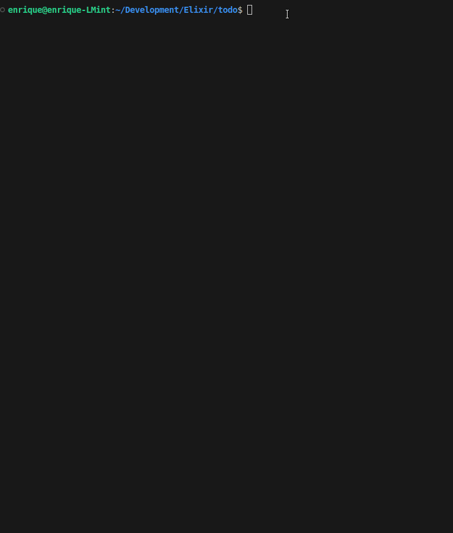

<div align="center">

# Elixir CLI Todoapp

### Example CLI to-do list application written in Elixir with SQLite3 database persistence.

<br />



<br /><br />
  
  

</div>

---

### Features 🚀:

Elixir is an incredibly robust and elegant programming language. It excels above many other languages in the reliability of its solutions, fault tolerance (typical of languages running on the BEAM VM), distributed computing, and, above all, the ease and reliability with which concurrent systems are built.

Elixir is designed to do a lot of things really well but it’s hard to beat languages that were designed specifically to be good for `CLI tools` without trading off the things that make it great for all other stuff. Languages like `Rust`, `Zig`, and especially `Go`, due to their ease of use (remember that the powerful Docker CLI and the Docker system itself are written in Go), are more suitable for creating CLI tools. However, when building CLI tools with Elixir, you'll rarely need to use its powerful features and will instead have to deal with the occasional inconvenience.

Among other things, we can mention the boot times required by Elixir applications, given that the `BEAM virtual machine` must be started (between 200 and 500 ms, depending on the machine on which it is running, but less than the `JVM` 😅). If the application is used as a simple interactive tool, this isn't a problem, but if it's used as a looped command within a shell script, this boot time would be an unacceptable hindrance.

The other problem is the lower portability resulting from compilation artifacts. With the aforementioned languages, we get a single executable and, in the case of Go, very easy cross-compilation for various operating systems. With Elixir, we have several options, each with its pros and cons. With Elixir releases, we get a folder that includes not only the compiled code but also the `Erlang virtual machine` and its default execution environment, so they do not need to be installed on the host where the application is run. However, this solution works better with [`daemons`](https://en.wikipedia.org/wiki/Daemon_(computing)) than with foreground CLI applications. They can only run on the same OS and with the same version as the one on which they were compiled, and they are not a single executable but a folder. [`Mix Escript`](https://hexdocs.pm/mix/1.18.4/Mix.Tasks.Escript.Build.html) does provide a single, lighter executable but requires the host to have `Erlang/OTP` installed. This looks perfect but it has one downside: it doesn't support projects or dependencies that need to store or read from the `priv` directory, as is the case of the [`tzdata`](https://github.com/lau/tzdata) library, which we use in this project as a dependency of another library, `Timex` (it connects to the Internet at startup and downloads the time zone update from the [`IANA tz database`](https://www.iana.org/time-zones)).

Fortunately, to overcome most if not all limitations, and be able to produce a single binary artifact, there's a fantastic OSS library called `Burrito` (which we'll cover next). It lets you wrap your meaty app so you can delight your CLI app users!

There are many situations in which a CLI application written in Elixir will not suffer the aforementioned drawbacks, mainly in the case of interactive tools that perform tasks that can be tedious or useful for a user, as in the case of this application, which, in any case, is oriented towards learning this fantastic language that is Elixir 😀.


- [x] **Using the [Burrito](https://github.com/burrito-elixir/burrito) library:** As stated in `Burrito`s own documentation: "Burrito is our answer to the problem of distributing Elixir CLI applications across varied environments, where we cannot guarantee that the Erlang runtime is installed, and where we lack the permissions to install it ourselves". Burrito uses [`Mix releases`](https://hexdocs.pm/mix/1.18.4/Mix.Tasks.Release.html) so we get all their benefits as well as a self-extracting archive. It creates a native binary for `macOS`, `Linux`, and `Windows`. It is very configurable and allows `cross-compilation` with almost no restrictions 😀. Consequently, the resulting binary is distributable, and neither Elixir nor Erlang/OTP is required. When you run it for the first time, a folder containing the `ERTS` ([`Erlang Runtime System Application`](https://www.erlang.org/doc/apps/erts/introduction.html)) and the BEAM virtual machine is automatically installed in the OS configuration folder.


- [x] **Using the [Timex](https://hexdocs.pm/timex/Timex.html) library:** We've already mentioned that this library uses `tzdata` under the hood, and we use it to make it easier to use time zones and format dates and times. `Ecto` (see below), by default, utilizes [`NaiveDateTime`](https://hexdocs.pm/elixir/NaiveDateTime.html) for `timestamps` in `migrations` and `schemas`. When using `timestamps()` in an `Ecto schema`, it generates two fields: `inserted_at` and `updated_at`. These fields default to using the naive_datetime type. If, on the other hand, we tell Ecto to store the timestamps with the `utc_datetime` type, this will save the `UTC time` in the database but will internally record the local time zone, which we can later "translate" into the time zone of the host running the application. All of this is probably unnecessary in an application like this, but it would make the database `SQLite` file more portable and, above all, allow us to learn how to use a new library 😅.


- [x] **Using the [Ecto](https://hexdocs.pm/ecto/3.13.2/Ecto.html) library:** Ecto (an official Elixir project) is a database wrapper and [`query language`]() for the Elixir programming language. It provides a way to interact with SQL databases, manage data, and build queries using Elixir syntax. Ecto is not an [`ORM`](https://en.wikipedia.org/wiki/Object%E2%80%93relational_mapping) (Object-Relational Mapper) in the traditional sense, as it doesn't automatically track changes to data like some ORMs do. Instead, it focuses on providing a flexible and powerful way to interact with databases while giving developers more control over data management. With Ecto we’re able to create migrations, define schemas, insert and update records, and query them. Although Ecto recommends using `PostgreSQL`, for a CLI project it is more appropriate to use [`SQLite3`](https://www.sqlite.org/)

- [x] **Finally, the application itself:** is configured around a recursive [loop](https://github.com/emarifer/elixir_cli_todoapp/blob/main/lib/todo.ex) that waits indefinitely for the user to enter a choice and responds accordingly. When the application starts (in the `Application.start/2` callback), this function is called as a [`Task process`](https://hexdocs.pm/elixir/Task.html) within the application's supervisor tree. It ends when the user chooses the `quit` option, which calls `System.halt/1`. For this recursive loop we were inspired by these publications:
    - [Statically linking an Elixir command-line application using Burrito](https://www.jonathanychan.com/blog/statically-linking-an-elixir-command-line-application-using-burrito/)
    - [Build a CLI Todo List using Elixir](https://akhil.sh/tutorials/elixir/elixir/03_cli_tool_using_elixir/)

### Getting Started 👨‍🚀:

- #### <ins>Installing the application on our system (Window, Linux only):</ins>

  The easiest way is to download the executable for your system from [here](https://github.com/emarifer/elixir_cli_todoapp/releases) and run it from the terminal in the download directory.

  This action will automatically create a hidden folder (`.burrito/todo_cli_app_erts-15.2.7_0.1.0/`) in the user's applications configuration directory. This folder basically contains the Erlang virtual machine and the runtime, so the application contains everything necessary to start without having to install anything first. Likewise, another folder (`todo_cli_app/`) will be created in the user configuration folder containing the `SQLite3` database storage file, and the migrations to create the table that will store the application data will be automatically executed. Once this is done, our application will start.

  Obviously, for user convenience, it's best to place the downloaded executable in any folder you want, but set its path in the system environment variable (`PATH`). Now, whenever we type the name of the executable (`todo_cli_app`) in the terminal, the application will launch.

  When we want to completely uninstall the application from our system, simply run the following command in the folder where the executable is located:

  ```
  $ ./my-binary maintenance uninstall
  ```

  This will delete the `.burrito/todo_cli_app_erts-15.2.7_0.1.0/` folder. Next, we can delete the executable itself and the `todo_cli_app/` folder in our configuration directory, where the database file is stored. Once all this is done, the application will be completely removed from the system.


- #### <ins>Compiling the application ourselves:</ins>

  - Prerequisites:
    
    Obviously, you'll need to install [`Elixir`](https://elixir-lang.org/install.html) and [`Erlang/OTP`](https://www.erlang.org/) (because you'll need to use its virtual machine). I recommend doing this through [`asdf`](https://asdf-vm.com/guide/getting-started.html). This will allow you to have multiple versions of Elixir installed and easily switch between them per project or set a global version for the system.
    
    >***I advise you to follow the recommendations made [here](https://github.com/emarifer/elixir-desktop-todoapp?tab=readme-ov-file#prerequisites) to create a more complete Erlang/OTP installation that will give you more options when developing with Elixir/Erlang.***

    If you want to package the application into a single statically linked binary for distribution, you'll need to install [Zig](https://ziglang.org/download/), since the `burrito` library creates a wrapper around the Elixir/Erlang application and packages it and all its dependencies into a single binary. It's important that the Zig version is `0.14.0`. Doing so is very easy: just download the version, unzip the `tar.xz` or `zip` file corresponding to your system/architecture, and you can drop it anywhere on your system as long as you set the path to the resulting directory in the environment variable. Test to see if it works by running the following command in the terminal:

    ```
    $ zig version # ==> 0.14.0
    ```

    You will also need to have xz (on Linux/MacOS) or zip (on Windows), but this is usually already installed on your stock system.

    Now you are ready to start!

  - Build the binary:

    Clone the repository and go to its directory and in your text editor open the [mix.exs](https://github.com/emarifer/elixir_cli_todoapp/blob/main/mix.exs#L51) file. In this file, modify the lines (commenting or uncommenting them) corresponding to the build targets you want.


    ```elixir

    defp releases do
      [
        todo_cli_app: [
          steps: [:assemble, &Burrito.wrap/1],
          burrito: [
            targets: [
              linux: [os: :linux, cpu: :x86_64],     # <==
              # macos: [os: :darwin, cpu: :x86_64]   # <==
              windows: [os: :windows, cpu: :x86_64]  # <==
            ]
          ]
        ]
      ]
    end
    ```

    Cross-compiling from Linux/MacOS to any other target is well-tested and supported. However, cross-compiling from Windows may not always work. In any case, `burrito` is rapidly evolving, and these circumstances may change. For any questions or modifications to compilation options, I recommend that you carefully read the [`burrito`](https://hexdocs.pm/burrito/readme.html) library documentation.

    Now in the root directory of the project run the command you would run to create any Elixir release:

    ```
    $ MIX_ENV=prod mix release
    ```

    The build may take more or less time depending on your machine and the number of targets you have set. Finally, a folder (burrito_out/) will be created in the project root, containing the executables. If you go into this folder and call them from the terminal:

    ```
    $ todo_cli_app_linux # e.g.
    ```

    The application will be installed, creating a hidden folder (`.burrito/todo_cli_app_erts-15.2.7_0.1.0/`) in the user's applications configuration directory, which contains the Erlang virtual machine and runtime. A folder (`todo_cli_app/`) will also be created in the user configuration directory, containing the `Sqlite3` database files. Next, the application will then start.


  - Developing/modifying the application in `dev mode`:

    If you have already cloned the repository you should follow the following steps.

    In the `mix.exs` file there is an `aliases` for a Mix task (`mix setup`) that will execute the download of the dependencies, the creation of the Sqlite3 database (in the root of the project, as established in the `dev.exs` configuration file) and will run the migrations that create the `tasks` table in the database:

    ```
    $ mix setup
    ```

    Now all that remains is to start the application with the command:

    ```
    $ mix run --no-halt
    ```

    Every time we make a change to the code, for it to be applied, we must stop the execution of the BEAM by typing `Ctrl+C` and then `a` and then call the previous command again.
    

---

### Happy coding 😀!!